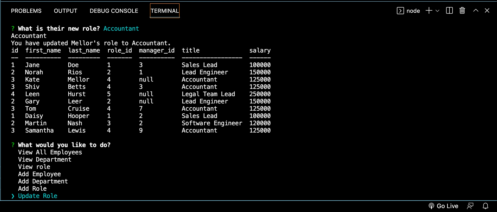

# Employee-Tracker

## Description
By using a command line input application, the user will be able to add departments, roles and employees. In addition to adding departments, roles and employees, the user can also update the employee role. The user will be able to view the information in the application in tables where they can also view the added and update functionality. Instead of the user having to manually type in an ID, the SQL SELECT was utilized to list possible options available in the cli.

## Video Demo
[Click here](https://drive.google.com/file/d/13BKMjip1tn6PKA6uaIz2-81VLhhzNFs4/view)

### Screenshot
